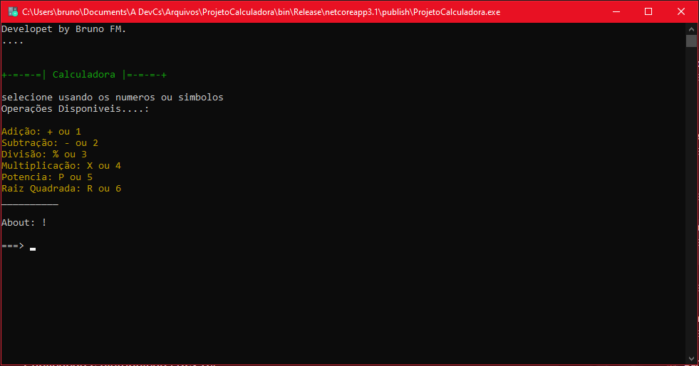

# ProjetoCalculadora
Este Programa foi criado com a intenção de ajuda com continhas matematicas em diversos tipos de operações

```
  _____ _____ _____ ____           ____  ____  
 | ____|_   _| ____/ ___|         / ___||  _ \ 
 |  _|   | | |  _|| |      _____  \___ \| |_) |
 | |___  | | | |__| |___  |_____|  ___) |  __/ 
 |_____| |_| |_____\____|         |____/|_|    
```

Curso Tecnico T.I: Etec Adolpho Berezin - Mongaguá

Disciplina: Programação De Compultadores
Aluno: Bruno Freitas Marmol

---

## _Screenshot_



---
## _Download_

Baixe o Arquivo abaixo e descompacte aonde desejar 😁

🗄️[Download do Arquivo](dist/CalculadoraFinal.zip)🗄️

```
Windowns: Duplo Clique
Linux...: dotnet ProjetoCalculadora.dll
```

---


## _Agradecimentos_

- [Figgle](https://github.com/drewnoakes/figgle)
- [ETEC](http://eteab.com.br/cms/)
- [Prof. Ermogenes](https://github.com/ermogenes)
- [Prof. Nery](https://github.com/diegoneri)
- [Dev C#](https://github.com/BrunoF-M/ProjetoCalculadora)

---